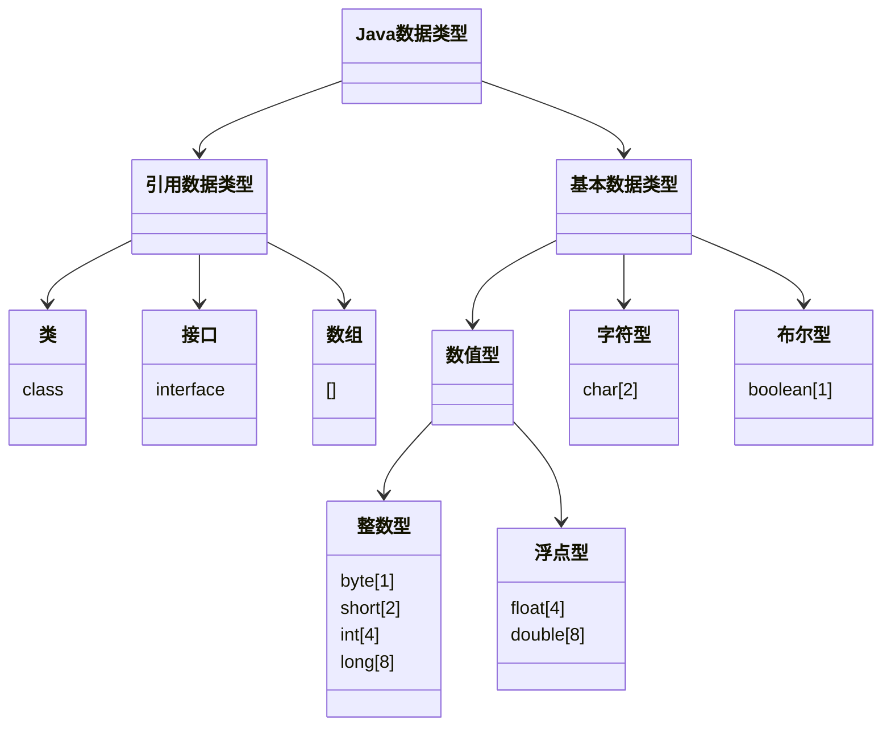

# Java学习记录

> 记录菜鸟Java的修仙之路~
> 💂 + 💻 = 👴🏽

## 第一阶段 🧱

### 概述 📕

- 计算机包括**硬件**和**软件**两部分组成

------


#### **硬件 **

```mermaid
 classDiagram
      总线 <|-- 中央处理器
      总线 <|-- 内存
      总线 <|-- 存储设备
      总线 <|-- 输入设备
      总线 <|-- 输出设备
      总线 <|-- 通信设备
      总线 : (bus)
      class 中央处理器{
      CPU
      }
      class 内存{
      主存
      }
      class 存储设备{
      如磁带、光盘、磁盘
      }
      class 输入设备{
      如键盘、鼠标
      }
      class 输出设备{
      如显示器、打印机
      }
      class 通信设备{
      如调制解调器、网卡
      }
```

#### 冯诺依曼体系结构

- 

  > 冯·[诺伊曼](https://baike.baidu.com/item/诺伊曼)体系结构是现代计算机的基础，现在大多计算机仍是冯·诺伊曼计算机的组织结构，只是作了一些改进而已，并没有从根本上突破冯体系结构的束缚。冯·诺伊曼也因此被人们称为“计算机之父”。

- 如何选择该学习哪种程序设计语言？


> 没有“**最好**”的语言，**各有所长**

#### Java特点

1. 面向对象  ***(oop)***

2. 强类型机制、异常处理、垃圾自动收集

3. **跨平台性**

   >即一个编译好的class文件可以在多个系统下运行，这种特性称为跨平台性

   ```mermaid
   graph LR
    	A(Test.java) --> |编译 javac| B{Test.class}
    	B --> |运行 java| C[Windows的JVM]
    	B --> |运行 java| D[Linux的JVM]
    	B --> |运行 java| E[Mac的JVM]
   ```

4. 解释型语言

   - 不能直接被机器执行，需要**解释器**对class文件进行解释执行

   >解释性语言：JavaScript、PHP、**Java**、Python
   >
   >编译性语言：C / C++

#### Java的开发工具

- 先选择**文本编辑本**，到对Java有一定了解后，再使用IDEA 和 Eclipse等

- 为什么？

  >1. 更深刻的理解Java技术，培养代码感
  >2. 有利于公司面试 [需要手写代码]

#### Java运行机制

- 核心机制——Java虚拟机 [***JVM java virtual machine***] 

  >1. JVM是一个虚拟的计算机，具有指令集并使用不同的存储区域，负责执行指令，管理数据、内存、寄存器，包含在**JDK**中。
  >2. 对于不同的平台，有不同的虚拟机
  >3. Java虚拟机屏蔽了底层运行平台的差别，实现了“一次**编译**，到处**运行**

- **什么叫做JDK,JRE？**

  - JDK介绍

    1. JDK全称 **Java Development Kit** ( Java 开发工具包 )

       >JDK = JRE + Java的开发工具[java, javac, javadoc, javap等]

    2. JDK是提供给开发人员使用的，其中包含了javac的开发工具，也**包括了JRE**。

  - JRE介绍

    1. JRE全称 **Java Runtime Environment** ( Java 运行环境 )

       > JRE = JVM + Java的核心类库[类]

    2. 如果想运行一个已经**开发好**的java程序（即`.class`文件）， 计算机**只需要安装JRE**即可

- **JDK**、**JRE** 和 **JVM**的包含关系

  1. JDK = JRE + 开发工具集
  2. JRE = JVM + Java SE标准类库

#### JDK的安装与配置

- 安装

  >⭐https://www.oracle.com/java/technologies/downloads/

- ***配置***  

  1. 复制根目录地址，右击我的电脑点击属性点击高级设置
  2. 点击环境变量，在上下两个变量区选择一个区新建
  3. 名字`JAVA_HOME` 下面一行将第一步复制的地址粘贴点击完成
  4. 选中`Path`点击编辑，新建，填入`%JAVA_HOME%\bin`,完成
  5. 在xx.java文件存储目录的地址栏输入`cmd`回车
  6. 输入"javac xx.java"编译，此时文件夹内多出一个`.class`文件，该文件为编译后的文件
  7. 接着在控制台输入"java xx.java",得到输出结果

#### 注意事项和细节说明

1. Java**源代码**以`.java`为扩展名，源文件的基本组成单位是**类**

2. Java应用程序的执行入口是**main()**方法。书写格式为：

   ```java
   public static void main(String[] args) {
       
   }
   ```

3. 严格区分大小写

4. Java方法由一条条语句构成，每个语句以"**；**"结束

5. 大括号**成对**

6. 一个源文件中最多**只能有一个**`public`类， 其他类的个数不限

7. 如果源文件包含一个`public`类，则文件名必须按该类名命名！

8. 可以将`main`方法写在**非**`public`类中， 然后指定运行非`public`类， 这样入口方法就是非`public`的`main`方法

#### 转义字符

1. **\t**	制表符

   ```java
   System.out.println("张三\t李四\t王五")
   ```

2. **\n**   换行符

   ```
   System.out.println("jack\nsmith\nmary")
   ```

3. **\\\\**    一个\

   ```
   System.out.println("D:\\Sublime Text\\Projests")
   ```

4. **\\"**   一个"

   ```
   System.out.println("老韩说：\"要好好学习java，有前途\"")
   ```

5. **\r**   回车符

   ```
   System.out.println("韩顺平教育\r北京")
   ```

#### 注释

1. 单行注释

   ```java
   //注释
   ```

2. 多行注释

   ```java
   /*
   
   */
   ```

   > 不允许有多行注释嵌套

3. 文本注释

   ```java
   /**
   *  @author	韩顺平
   *  @version	1.0
   */
   ```

   > 注释内容可以被JDK提供的工具`javadoc`所解析， 生成一套以网页文件形式体现的该程序的说明文档， 一般写在类

   - 如何生成对应的文档注释？

   - 应用实例

     >javadoc -d 文件夹名 -xx -yy Demo.java

   - `javadoc`标签

     | 标签 | 描述 | 示例 |
     | :--: | :--: | :--: |
     |      |      |      |
     |      |      |      |
     |      |      |      |
     |      |      |      |
     |      |      |      |
     |      |      |      |
     |      |      |      |
     |      |      |      |
     |      |      |      |
     |      |      |      |
     |      |      |      |
     |      |      |      |
     |      |      |      |
     |      |      |      |
     |      |      |      |
     |      |      |      |
     |      |      |      |

#### 代码规范(初学)

1. `类`、`方法`的注释， 要以`javadoc`的方式来写
2. 非`javadoc`的注释， 往往是给代码的维护者看的， 着重告诉读者为什么这样写， 如何修改， 注意什么问题等
3. 使用`Tab`操作，实现缩进， 默认整体向右移动， `shift + Tab`则相反
4. `运算符`和 `=` 两边习惯性各加一个空格
5. 源文件使用`utf-8`编码
6. 行宽度不要超过80字符
7. 代码编写`次行风格`和`行尾风格`

#### DOS [Disk Operating System]

- 基本原理

  ```mermaid
   graph LR
   A(DOS指令) --> B{DOS系统}
   B --> C(1.接收指令)
   C --> D(2.解析指令)
   D --> E(3.执行指令)
   E --> F(完成)
  ```

- **路径详解(重要)**

  > `相对路径`：从当前目录开始定位，形成的一个路径
  >
  > `绝对路径`：从顶级目录D， 开始定位， 形成的路径

  ```mermaid
   classDiagram
  	D盘 --> abc文件夹1
  	D盘 --> abc文件夹2
  	abc文件夹1 --> test100文件夹1
  	abc文件夹1 --> test200文件夹1
  	abc文件夹2 --> test100文件夹2
  	abc文件夹2 --> test200文件夹2
  ```

- 常用的`DOS`命令

  1. 查看当前目录

     ```
     dir d:\abc2\test200文件夹1
     ```

  2. 切换到其他目录下

     ```
     cd /D c:
     ```

  3. 切换到当前盘的其他目录下

     ```
     cd d:\abc文件夹2\test100文件夹2 cd ..\..\abc文件夹2\test200
     ```

  4. 切换到上一级

     ```
     cd ..
     ```

  5. 切换到根目录

     ```
     cd \
     ```

  6. 查看指定目录下所有的子级目录

     ```
     tree c:
     ```

  7. 清屏

     ```
     cls
     ```

  8. 退出DOS

     ```
     exit
     ```

  9. 说明：DOS在后面用得很少
     了解即可（在之后学习**Linux**需掌握指令）


------

###  变量 🔢

------

#### 概念

> `变量`相当于内存中一个数据存储空间的表示， 你可以把`变量`看作是一个房间的门牌号， 通过门牌号我们可以找到房间， 而通过`变量`名可以访问到`变量`（值）

#### 为什么需要变量？

- `变量`是程序的基本组成单位

  > 不论是使用哪种高级编程语言编写程序， 变量都是其程序的基本组成单位

#### 变量使用的基本步骤

1. 声明`变量`

   ```
   int a;
   ```

2. 赋值

   ```
   a = 60;
   ```

   [^ps]:通常一步到位， 即`变量`的使用 = 类型 + 名称 + 值

   ```
   int a = 60;
   ```

3. 使用输出

   ```
   System.out.println(a)
   ```

#### 尝试编写个人信息

```java
public static void main(String[] args) {
    //Record
    int age = 18;
    double score = 88.9;
    char gender = '男';
    String name = 'King';
    
    //Output
    System.out.println("本人信息如下：");
    System.out.println("age");
    System.out.println("score");
    System.out.println("gender");
    System.out.println("name")
}
```

#### 变量细节

1. `变量`表示内存中的一个存储区域[不同的`变量`， 类型不同， 占用的空间大小不同， 比如：int 4个字节；double 8个字节]
2. 变量必须先声明， 后使用
3. 该区域的数值可以在同一类型范围内不断变化
4. 变量在同一个`作用域`内不能重名

####  + 号的使用

1. 当左右两边都为数值型时， 做加法运算

2. 当左右两边有一方为字符串时， 做拼接运算

   ##### 尝试：

```java
System.out.println(100 + 98);//198
System.out.println("100" + 98);//10098
System.out.println(100 + 3 + "hello");//103hello
System.out.println("hello" + 100 + 3);//hello1003
```

#### 数据类型(必背)

> 图示：



##### 整数类型

> 用于存放整数值


------

### 运算符

------

### 程序控制结构

------

### 数组、排序和查找

------

### 面向对象编程（基础部分）

------

### 房屋出租系统

------

### 面向对象编程（中级部分）

------


## 第二阶段 ⚙️

### 面向对象编程（高级部分）

------

### 枚举和注解

------

### 异常

------

### 常用类

------

### 集合

------

### 泛型

------

### 坦克大战1

------

### 多线程编程

------

### 坦克大战2

------

### IO流

------

### 坦克大战3

------

## 第三阶段 🛖

### 网络编程

------

### 多用户即时通信系统

------

### 反射

------

### 零基础学MySQL

------

### JDBC和数据库连接池

------

### 满汉楼

------

### 正则表达式

------

### 算法——骑士周游问题

------

## 总结 📒

