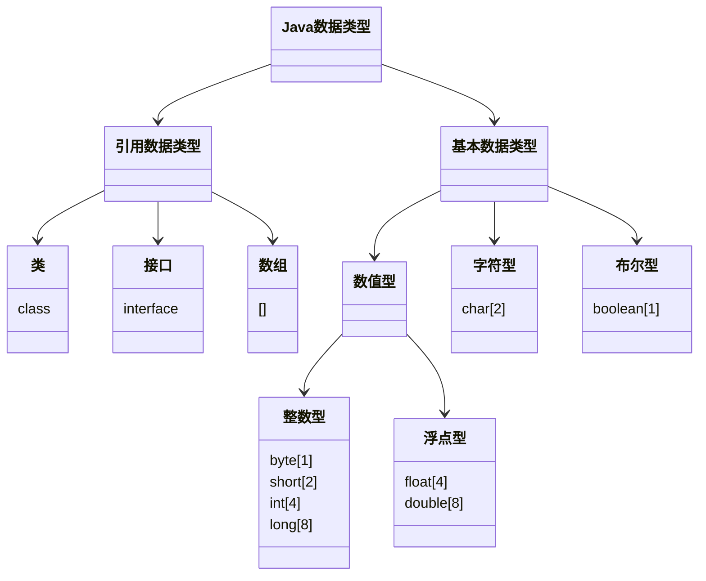
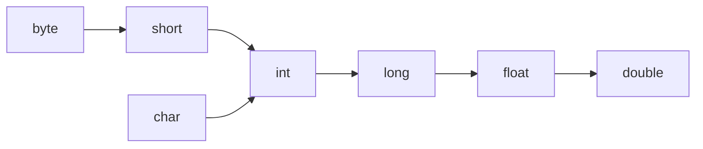

[toc]


# Java学习记录 

> 记录菜鸟Java的修仙之路~
> 💂 + 💻 = 👴🏽

## 第一阶段 🧱

### 概述 📕

- 计算机包括**硬件**和**软件**两部分组成


#### 硬件

```mermaid
 classDiagram
      总线 <|-- 中央处理器
      总线 <|-- 内存
      总线 <|-- 存储设备
      总线 <|-- 输入设备
      总线 <|-- 输出设备
      总线 <|-- 通信设备
      总线 : (bus)
      class 中央处理器{
      CPU
      }
      class 内存{
      主存
      }
      class 存储设备{
      如磁带、光盘、磁盘
      }
      class 输入设备{
      如键盘、鼠标
      }
      class 输出设备{
      如显示器、打印机
      }
      class 通信设备{
      如调制解调器、网卡
      }
```

#### 冯诺依曼体系结构

- 

  > 冯·[诺伊曼](https://baike.baidu.com/item/诺伊曼)体系结构是现代计算机的基础，现在大多计算机仍是冯·诺伊曼计算机的组织结构，只是作了一些改进而已，并没有从根本上突破冯体系结构的束缚。冯·诺伊曼也因此被人们称为“计算机之父”。

- 如何选择该学习哪种程序设计语言？


> 没有“**最好**”的语言，**各有所长**

#### Java特点

1. 面向对象  ***(oop)***

2. 强类型机制、异常处理、垃圾自动收集

3. **跨平台性**

   >即一个编译好的class文件可以在多个系统下运行，这种特性称为跨平台性

   ```mermaid
   graph LR
    	A(Test.java) --> |编译 javac| B{Test.class}
    	B --> |运行 java| C[Windows的JVM]
    	B --> |运行 java| D[Linux的JVM]
    	B --> |运行 java| E[Mac的JVM]
   ```

4. 解释型语言

   - 不能直接被机器执行，需要**解释器**对class文件进行解释执行

   >解释性语言：JavaScript、PHP、**Java**、Python
   >
   >编译性语言：C / C++

#### Java的开发工具

- 先选择**文本编辑本**，到对Java有一定了解后，再使用IDEA 和 Eclipse等

- 为什么？

  >1. 更深刻的理解Java技术，培养代码感
  >2. 有利于公司面试 [需要手写代码]

#### Java运行机制

- 核心机制——Java虚拟机 [***JVM java virtual machine***] 

  >1. JVM是一个虚拟的计算机，具有指令集并使用不同的存储区域，负责执行指令，管理数据、内存、寄存器，包含在**JDK**中。
  >2. 对于不同的平台，有不同的虚拟机
  >3. Java虚拟机屏蔽了底层运行平台的差别，实现了“一次**编译**，到处**运行**

- **什么叫做JDK,JRE？**

  - JDK介绍

    1. JDK全称 **Java Development Kit** ( Java 开发工具包 )

       >JDK = JRE + Java的开发工具[java, javac, javadoc, javap等]

    2. JDK是提供给开发人员使用的，其中包含了javac的开发工具，也**包括了JRE**。

  - JRE介绍

    1. JRE全称 **Java Runtime Environment** ( Java 运行环境 )

       > JRE = JVM + Java的核心类库[类]

    2. 如果想运行一个已经**开发好**的java程序（即`.class`文件）， 计算机**只需要安装JRE**即可

- **JDK**、**JRE** 和 **JVM**的包含关系

  1. JDK = JRE + 开发工具集
  2. JRE = JVM + Java SE标准类库

#### JDK的安装与配置

- 安装

  >⭐https://www.oracle.com/java/technologies/downloads/

- ***配置***  

  1. 复制根目录地址，右击我的电脑点击属性点击高级设置
  2. 点击环境变量，在上下两个变量区选择一个区新建
  3. 名字`JAVA_HOME` 下面一行将第一步复制的地址粘贴点击完成
  4. 选中`Path`点击编辑，新建，填入`%JAVA_HOME%\bin`,完成
  5. 在xx.java文件存储目录的地址栏输入`cmd`回车
  6. 输入"javac xx.java"编译，此时文件夹内多出一个`.class`文件，该文件为编译后的文件
  7. 接着在控制台输入"java xx.java",得到输出结果

#### 注意事项和细节说明

1. Java**源代码**以`.java`为扩展名，源文件的基本组成单位是**类**

2. Java应用程序的执行入口是**main()**方法。书写格式为：

   ```java
   public static void main(String[] args) {
       
   }
   ```

3. 严格区分大小写

4. Java方法由一条条语句构成，每个语句以"**；**"结束

5. 大括号**成对**

6. 一个源文件中最多**只能有一个**`public`类， 其他类的个数不限

7. 如果源文件包含一个`public`类，则文件名必须按该类名命名！

8. 可以将`main`方法写在**非**`public`类中， 然后指定运行非`public`类， 这样入口方法就是非`public`的`main`方法

#### 转义字符

1. **\t**	制表符

   ```java
   System.out.println("张三\t李四\t王五")
   ```

2. **\n**   换行符

   ```
   System.out.println("jack\nsmith\nmary")
   ```

3. **\\\\**    一个\

   ```
   System.out.println("D:\\Sublime Text\\Projests")
   ```

4. **\\"**   一个"

   ```
   System.out.println("老韩说：\"要好好学习java，有前途\"")
   ```

5. **\r**   回车符

   ```
   System.out.println("韩顺平教育\r北京")
   ```

#### 注释

1. 单行注释

   ```java
   //注释
   ```

2. 多行注释

   ```java
   /*
   
   */
   ```

   > 不允许有多行注释嵌套

3. 文本注释

   ```java
   /**
   *  @author	韩顺平
   *  @version	1.0
   */
   ```

   > 注释内容可以被JDK提供的工具`javadoc`所解析， 生成一套以网页文件形式体现的该程序的说明文档， 一般写在类

   - 如何生成对应的文档注释？

   - 应用实例

     >javadoc -d 文件夹名 -xx -yy Demo.java

   - `javadoc`标签

     | 标签 | 描述 | 示例 |
     | :--- | :--- | :--- |
     |      |      |      |
     |      |      |      |
     |      |      |      |
     |      |      |      |
     |      |      |      |
     |      |      |      |
     |      |      |      |
     |      |      |      |
     |      |      |      |
     |      |      |      |
     |      |      |      |
     |      |      |      |
     |      |      |      |
     |      |      |      |
     |      |      |      |
     |      |      |      |
     |      |      |      |

#### 代码规范(初学)

1. `类`、`方法`的注释， 要以`javadoc`的方式来写
2. 非`javadoc`的注释， 往往是给代码的维护者看的， 着重告诉读者为什么这样写， 如何修改， 注意什么问题等
3. 使用`Tab`操作，实现缩进， 默认整体向右移动， `shift + Tab`则相反
4. `运算符`和 `=` 两边习惯性各加一个空格
5. 源文件使用`utf-8`编码
6. 行宽度不要超过80字符
7. 代码编写`次行风格`和`行尾风格`

#### DOS [Disk Operating System]

- 基本原理

  ```mermaid
   graph LR
   A(DOS指令) --> B{DOS系统}
   B --> C(1.接收指令)
   C --> D(2.解析指令)
   D --> E(3.执行指令)
   E --> F(完成)
  ```

- **路径详解(重要)**

  > `相对路径`：从当前目录开始定位，形成的一个路径
  >
  > `绝对路径`：从顶级目录D， 开始定位， 形成的路径

  ```mermaid
   classDiagram
  	D盘 --> abc文件夹1
  	D盘 --> abc文件夹2
  	abc文件夹1 --> test100文件夹1
  	abc文件夹1 --> test200文件夹1
  	abc文件夹2 --> test100文件夹2
  	abc文件夹2 --> test200文件夹2
  ```

- 常用的`DOS`命令

  1. 查看当前目录

     ```
     dir d:\abc2\test200文件夹1
     ```

  2. 切换到其他目录下

     ```
     cd /D c:
     ```

  3. 切换到当前盘的其他目录下

     ```
     cd d:\abc文件夹2\test100文件夹2 cd ..\..\abc文件夹2\test200
     ```

  4. 切换到上一级

     ```
     cd ..
     ```

  5. 切换到根目录

     ```
     cd \
     ```

  6. 查看指定目录下所有的子级目录

     ```
     tree c:
     ```

  7. 清屏

     ```
     cls
     ```

  8. 退出DOS

     ```
     exit
     ```

  9. 说明：DOS在后面用得很少
     了解即可（在之后学习**Linux**需掌握指令）


------

###  变量 🔢

#### 概念

> `变量`相当于内存中一个数据存储空间的表示， 你可以把`变量`看作是一个房间的门牌号， 通过门牌号我们可以找到房间， 而通过`变量`名可以访问到`变量`（值）

#### 为什么需要变量？

- `变量`是程序的基本组成单位

  > 不论是使用哪种高级编程语言编写程序， 变量都是其程序的基本组成单位

#### 变量使用的基本步骤

1. 声明`变量`

   ```
   int a;
   ```

2. 赋值

   ```
   a = 60;
   ```

   [^ps]:通常一步到位， 即`变量`的使用 = 类型 + 名称 + 值

   ```
   int a = 60;
   ```

3. 使用输出

   ```
   System.out.println(a)
   ```

#### 尝试编写个人信息

```java
public static void main(String[] args) {
    //Record
    int age = 18;
    double score = 88.9;
    char gender = '男';
    String name = 'King';
    
    //Output
    System.out.println("本人信息如下：");
    System.out.println("age");
    System.out.println("score");
    System.out.println("gender");
    System.out.println("name")
}
```

#### 变量细节

1. `变量`表示内存中的一个存储区域[不同的`变量`， 类型不同， 占用的空间大小不同， 比如：int 4个字节；double 8个字节]
2. 变量必须先声明， 后使用
3. 该区域的数值可以在同一类型范围内不断变化
4. 变量在同一个`作用域`内不能重名

####  + 号的使用

1. 当左右两边都为数值型时， 做加法运算

2. 当左右两边有一方为字符串时， 做拼接运算

   ##### 尝试：

```java
System.out.println(100 + 98);//198
System.out.println("100" + 98);//10098
System.out.println(100 + 3 + "hello");//103hello
System.out.println("hello" + 100 + 3);//hello1003
```

#### 数据类型(必背)

##### 图示



##### 整数类型

> 用于存放整数值

| 类型          | 占用存储空间 | 范围                                                 |
| :------------ | :----------- | :--------------------------------------------------- |
| byte[字节]    | **1字节**    | -2^7^ ~ 2^7^ - 1<br />为啥存放的范围是这个 => 二进制 |
| short[短整型] | **2字节**-   | -2^15^ ~ 2^15^ - 1                                   |
| int[整型]     | **4字节**    | -2^31^ ~ 2^31^ - 1                                   |
| long[长整型]  | **8字节**    | -2^63^ ~ 2^63^ - 1                                   |

```
byte n1 = 10;//1个字节
short n2 = 10;//2个字节
int n3 = 10;//4个字节
long n4 = 10;//8个字节
```

###### 使用细节

1. Java各整数类型有固定的范围和字段长度， 不受具体`OS`影响， 以保证`java`程序的可移植性

2. Java整型常量默认为`int`型， 声明`long`型常量须后加 '**l**' 或 '**L**'

3. Java程序中变量常声明为`int`型， 除非不足以表示大数， 才使用`long`

4. `bit`: 计算机中最小存储单位
   `byte`: 计算机中基本存储单位

   [^两者关系]: 1 byte = 8 bit

##### 浮点类型

> 表示一个小数

###### 分类

| 类型         | 占用存储空间 | 范围                   |
| ------------ | ------------ | ---------------------- |
| 单精度float  | **4字节**    | -3.403E38 ~ 3.40E38    |
| 双精度double | **8字节**    | -1.798E308 ~ 1.708E308 |

###### 说明

1. 关于浮点数在机器中存放形式的简单说明， `浮点数 = 符号位 + 指数位 + 尾数位`
2. 尾数部分可能丢失， 造成精度损失（小数都是近似值）

###### 使用细节

1. 与整数类型一样， Java各浮点类型有固定的范围和字段长度， 不受具体`OS`影响

2. Java的浮点型常量默认为`double`型， 声明`float`型常量， 须在后加 ‘**f**’ 或 ‘**F**’

   >double num1 = 2.1234567851;
   >
   >float num2 = 2.1234567851F;

3. 浮点型常量有两种表示形式

   > 十进制：如：5.12	512.0f	.512	(必须要有小数点)
   >
   > 科学计数法： 如： 5.12e2	5.12E2

4. 通常情况下， 应该使用double型， 因为它比float型更精准

5. 浮点数陷阱：2.7 和 8.1 / 3 比较

   ```java
   double num3 = 2.7;
   double num4 = 8.1/3;
   System.out.println(num3);//2.7
   System.out.println(num4);//接近2.7的一个小数
   ```

   

   > 因此当我们对运算结果是小数的进行相等判断时， 应该是以两个数的差值的绝对值， 在某个精度范围内判断

   ```java
   //错误
   if (num3 == num4) {
       System.out.println("相等")
   }
   //正确
   if (Math.abs(num3 - num4) < 0.0000000001) {
       System.out.println("差值非常小，到我规定的精度，认为相等……")
   }
   ```

##### 字符类型

> 表示单个字符（可以存放汉字）

```java
char c1 = 'a';
char c2 = '\t';
char c3 = '韩';
char c4 = 97;//字符 => 编码的概念
```

###### 使用细节

1. `char`常量时用单引号`‘’`括起来的单个字符
2. Java 中，char的本质是一个整数， 在输出时， 是unicode码对应的字符
3. `char`类型可以进行运算

###### 本质探讨

- [^存储]:'a' ==>  码值 ==>  二进制 ==> 存储

- [^读取]:二进制 ==> 97 ==> 'a' ==> 显示

###### 演示

```java
System.out.println('a' + 10);//107

char c5 = 'b' + 1;//98+1 ++> 99
System.out.println((int)c5);//99
System.out.println(c5);//字符
```

###### 字符编码表

- **ASCII**： 一个字节表示（实际一个字节能保存256个字符），共有128个字符
- **Unicod**： 字母汉字统一两个字节表示（占用空间），最多编码2^16^个字符，兼容ASCII
- **utf-8**： 字母一个字节，汉字3个字节，使用最广，可以使用1-6个字节表示一个符号
- **gbk**： 字母一个字节， 汉字两个字节
- **big5码**： 繁体中文，中国香港，中国台湾

##### 布尔类型

###### 介绍

1. 只允许取值`true`和`false`。无`null`
2. 占一个字节
3. 适用于逻辑运算

- while
- do-while
- for

###### 使用细节

> 不可以0或非0的整数代替false和true， 这点和C语言不同

#### 类型转换

##### 自动类型转换

###### 介绍

> 当java程序在进行赋值或者运算时， 精度小的类型自动转换成精度大的数据类型

###### 大小顺序



###### 演示

```java
int a = 'a';//OK
double d = 80;//OK
```

###### 细节

1. 有多种类型的数据混合运算时， 系统首先自动将所有数据转换成精度最大的那种数据类型， 然后再计算

    ```java
    int n1 = 10;
    float d1 = n1 + 1.1;//false => 结果类型是double
    double d1 = n1 + 1.1;//true
    ```

2. 当我们把精度大的数据类型赋值给精度小的数据类型，会报错

    ```java
    int n2 = 1.1;//false => double精度>int精度
    ```

3. （`byte`, `short`）和 `char` 之间不会相互自动转换（当作规则理解）

4. 当把具体数值赋给 `byte` 时， 先判断该数是否在 `byte` 范围内， 如果是就可以

    ```java
    byte b1 = 10;//true  -128 - 127
    int n3 = 1;
    byte b2 = n3;//false 如果是变量赋值， 判断类型
    ```

5. `byte`, `short`, `cha`r 它们三者可以计算， 在计算时首先转换成 `int` 类型

    ```java
    byte b3 = 1;
    byte b4 =2;
    short s1 = 1;
    short s2 = s1 + b3;//false 结果类型为int
    int s2 = b2 + s1;//true
    byte b5 = b3 + b4;//false
    ```

6.  `boolean` 不参与转换

    ```java
    boolean pass = true;
    int num100 = pass;//false
    ```

7. 自动提升原则： 表达式结果的类型自动提升为操作数中最大的类型

    ```java
    byte b6 = 1;
    short s3 = 100;
    int num200 = 1;
    double num300 = 1.1;
    
    float = num300 + num200 + s3 + b6;//false 结果类型为double
    ```

##### 强制类型转换

###### 介绍

> 自动类型转换的逆过程， 将精度大的数据类型转换成精度小的数据类型

###### 格式

```java
int i = (int)1.9;
```

###### 演示

```java
int n2 = 2000;
int n1 = (int)1.9;//1	精度损失
byte b1 = (byte) n2;//数据溢出
```

###### 细节

1. 当大 --> 小时，就需要使用强制类型转换

2. 强转符号只对最近的操作数有效，往往使用小括号提升优先级

    ```java
    int x =(int)(10 * 3.5 + 6 * 1.5);
    ```

3. `char`类型可以保存`int`的常量值， 但不能保存`int`的变量值， 需要强转

    ```java
    char c1 = 100;//OK
    int m = 100;
    char c2 = m;//false
    char c3 = (char)m;//true
    ```

4. `byte`, `short`, `cha`r 它们三者可以计算， 在计算时首先转换成 `int` 类型

##### 练习

```java
1.  short s = 12;
	s = s - 9;
2.	byte b =10;
	b = b + 11;
	b = (byte)(b + 11);
3.	char c = 'a';
	int i = 16;
	float d = .314F;
	double result = c + i + d;
4.	byte b = 16;
	short s = 14;
	short t = s + b;
```

> 1.
>
> true
>
> false
>
> 2.
>
> true
>
> false
>
> true
>
> 3.
>
> true
>
> true
>
> true
>
> true
>
> 4.
>
> true
>
> true
>
> false

##### 基本数据类型和String类型的转换

###### 基本数据类型转String类型

> 语法： 将基本类型的值 + “” 即可

```java
int n1 = 100;
String str1 = n1 + ""
```

###### String类型转基本数据类型

> 通过基本类型的包装类调用parseXX方法即可

```java
Integar.parseInt("123");
Double.parseDouble("123.1");
Boolean.parseBoolean("true");
```

###### 注意事项

1. 在将String类型转成基本数据类型时，要确保有效数据， 例如不能把“hello”转成一个整数
2. 如果格式不正确程序将终止， 这个问题在后续异常处理章节， 会处理

#### Java API 文档

1. **API** [*Application Programming Interface*, *应用程序编程接口*]

   [^中文在线文档]:http://www.matools.com

2. Java 类的组织形式

   ```mermaid
    graph LR
    	A(JDK8,11) --> B(包1)
    	A(JDK8,11) --> C(包2)
    	A(JDK8,11) --> D(包...)
    	C(包2) --> E(接口)
    	C(包2) --> F(类...)
    	C(包2) --> G(异常)
    	F(类...) --> H(字段...)
    	F(类...) --> I(构造器)
    	F(类...) --> J(成员方法)
    	Java类的组织形式
   ```


------

### 运算符

#### 介绍

> 是一种特殊的符号， 用以表示数据的运算、赋值和比较等

1. 算术
2. 赋值
3. 关系
4. 逻辑
5. 位
6. 三元

#### 算术运算符

##### 介绍

> 对数值类型的变量进行运算

##### 图示

| 运算符 | 运算                                                     | 范例                                 | 结果                            |
| ------ | -------------------------------------------------------- | ------------------------------------ | ------------------------------- |
| +      | 正号                                                     | +7                                   | 7                               |
| -      | 负号                                                     | b = 11; -b                           | -11                             |
| +      | 加                                                       | 9 + 9                                | 18                              |
| -      | 减                                                       | 10 - 8                               | 2                               |
| *      | 乘                                                       | 7 * 8                                | 56                              |
| /      | 除                                                       | 9 / 9                                | 1                               |
| %      | 取余                                                     | 11 % 9                               | 1                               |
| ++     | 自增（前）： 先运算后赋值<br />自增（后）： 先赋值后运算 | a = 2; b = ++a;<br />a = 2; b = a++; | a = 3;b = 3;<br />a = 1;b = 2;  |
| --     | 同上                                                     | a = 2;b = --a;<br />a = 2;b = a--    | a = 1; b = 1;<br />a = 1;b = 2; |
| +      | 字符串相加                                               | “hsp” + "edu"                        | "hsp edu"                       |

```java
System.out.println(10 / 4);//从数学来看时2.5，java中是2
System.out.println(10.0 / 4);//java是2.5
double d = 10 / 4;
System.out.println(d);//java中是2， 2 => 2.0

//%的本质： a % b = a - a / b * b
System.out.println(-10 % 3);//-1
System.out.println(10 % 3);//1
System.out.println(-10 / -3);//-1
```

##### 细节

1. 取余本质： a % b = a - a / b * b
2. 对于除号"/"，它的整数除和小数除是有区别的：整数之间做除法时， 只保留整数部分而舍弃小数部分

##### 题目

```java
int i = 1;
i = i++;//规则使用临时变量：（1）temp = i;（2）i = i + 1;（3）i = temp;
System.out.println(i);//1

int i = 1;
i = ++i;//规则使用临时变量：（1）i = i + 1;（2）temp = i;（3）i = temp;
System.out.println(i)//2
```

1. 假如还有59天放假，问：合XX个星期零XX天

    ```java
    int days = 59;
    int weeks = days / 7;
    int leftDays = days % 7;
    System.out.println(days + "天合" + weeks + "个星期零" + leftDays)
    ```

    

2. 华氏温度转换：5 / 9 * (华氏温度 - 100), 求出华氏温度对应的摄氏度

    ```java
    double F = 234.6;
    double C = 5 / 9 * (F - 100);
    System.out.println(C);
    ```

#### 关系运算符

##### 介绍

> 结果都是boolean型

##### 图示

| 运算符     | 运算               | 范例                    | 结果  |
| ---------- | ------------------ | ----------------------- | ----- |
| ==         | 相等于             | 8 == 7                  | false |
| !=         | 不等于             | 8 != 7                  | true  |
| <          | 小于               | 8 < 7                   | false |
| >          | 大于               | 8 > 7                   | true  |
| <=         | 小于等于           | 8 <= 7                  | false |
| >=         | 大于等于           | 8 >= 7                  | true  |
| instanceof | 检查是否是类的对象 | "hsp" instanceof String | true  |

#### 逻辑运算符

##### 一览

1. 短路与 `&&`， 短路或 `||`， 取反` ！`
2. 逻辑与 `&`， 逻辑或` |`， 逻辑异或 `^`

##### 图示

| a    | b    | a & b | a && b | a \| b | a \|\| b | !a   | a ^ b |
| ---- | ---- | ----- | ------ | ------ | -------- | ---- | ----- |
| T    | T    | T     | T      | T      | T        | F    | F     |
| T    | F    | F     | F      | T      | T        | F    | T     |
| F    | T    | F     | F      | T      | T        | T    | T     |
| F    | F    | F     | F      | F      | F        | T    | F     |

##### && 和 &

1. `&&`短路与： 如果第一个条件为`false`， 则第二个条件不会判断， 最终结果为`false`， 效率高

2. `&`逻辑与： 不管第一个条件是否为`false`， 第二个条件都要判断， 效率低

3. 开发中， 使用的基本是短路与`&&`， 效率高

    ```java
    int a = 4;
    int b = 9;
    
    //短路与
    if (a < 1 && ++b < 50) {
        System.out.println("ok300");
    }
    System.out.println("a = " + a + "b = " + b);//a = 4;b = 9
    
    //逻辑与
    if (a < 1 & ++b < 50) {//先执行，再判断
        System.out.println("ok300");
    }
    System.out.println("a = " + a + "b = " + b);//a = 4;b = 10
    ```

##### || 和 |

1. `||`短路或： 如果第一个条件为`false`， 则第二个条件不会判断， 最终结果为`false`， 效率高

2. `|`逻辑或： 不管第一个条件是否为`false`， 第二个条件都要判断， 效率低

3. 开发中， 使用的基本是短路或`||`， 效率高

    ```java
    int a = 4;
    int b = 9;
    
    //短路或
    if (a > 1 || ++b > 4) {
        System.out.println("ok300");
    }
    System.out.println("a = " + a + "b = " + b);//a = 4;b = 9
    
    //逻辑或
    if (a < 1 | ++b < 50) {//先执行，再判断
        System.out.println("ok300");
    }
    System.out.println("a = " + a + "b = " + b);//a = 4;b = 10
    ```


#### 赋值运算符

- 基本赋值运算符

- 复合赋值运算符

    > a += b; [等价 a = a + b]
    >
    > a -= b;  [等价 a = a - b]

##### 特点

1. 运算顺序从左到右

2. 左边只能是变量，右边可以是变量、表达式、常量值

3. 复合赋值运算符会进行类型转换

    ```java
    byte b = 3;
    b += 2;//等价 b = (byte)(b + 2)
    b++;// (byte)(b + 1)
    ```

#### 三元运算符

##### 基本语法

> 条件表达式？表达式1：表达式2

##### 规则

1. 如果条件表达式为`true`， 运算后的结果是表达式1；

2. 如果条件表达式为`false`， 运算后的结果是表达式2；

    [^口诀]:一灯大师：一真大师

##### 案例

```java
int a = 10;
int b =99;
//1.a > b 为false
//2.返回 b--。 先返回b 的值， 然后再 b-1
//3.返回的结果是99
int result = a > b ? a++ : b--;
//修改
int result = a < b ? a++ : b--;//10
System.out.println("a = " + a);//11
System.out.println("b = " + b);//99
```

##### 使用细节

1. 表达式1和表达式2要为可以赋给接收变量的类型（或可以自动转换、强制转换）

    ```java
    int a = 3;
    int b =8;
    int c = a > b ? a : b;//true
    int c = a > b ? 1.1 : 3.4;//false
    int c = a > b ? (int)1.1 : (int)3.4;//true
    double d = a > b ? a : b + 3;//true 自动转换int -> double
    ```

    

2. 三元转换符可以转换成if-else语句

    ```java
    int res = a > b ? a++ : --b;
    
    if (a > b) {
        res = a++;
    }else {
        res = --b;
    }
    ```
    

##### 实现三个数的最大值

```java
int n1 = 55;
int n2 = 33;
int n3 = 123;

/*思路
	1.先得到 n1 和 n2 中最大的数， 保存到max1
	2.然后再求出 max1 和 n3 中最大的数， 保存到max2
*/

int max1 = n1 > n2 ? n1 : n2;
int max2 = max1 > n3 ? max1 : n3;

//使用一条语句实现,推荐上面方法
int max = (n1 > n2 ? n1 : n2) > n3 
    		? (n1 > n2 ? n1 : n2) : n3;
```

#### 运算符优先级

1. 运算符有不同的优先级， 如下表，上一行运算符总优先于下一行

    |      | .    []    {}    ;     ,                     |
    | ---- | -------------------------------------------- |
    | 单目 | ++    --    ~    ！                          |
    | 算术 | *    /    %    +    -                        |
    | 位移 | <<    >>    >>>                              |
    | 比较 | >    <    <=    >=    instanceof    ==    != |
    | 逻辑 | &    ^    \    &&    \|\|                    |
    | 三元 | ?    :                                       |
    | 赋值 | =    *=    /=    %=                          |

2. 只有单目运算符、赋值运算符是从右往左运算的

#### 标识符命名规则和规范

##### 概念

1. Java对各种变量、方法和类等命名时使用的字符序列称为标识符
2. 凡是自己可以起名字的地方都叫标识符

##### 规则

1. 由26个英文字母大小写， 0-9， 或$组成
2. 数字不能开头 int 3ab = 1;//false
3. 不可以使用关键字和保留字，但能包括关键字和保留字
4. 严格区分大小写，长度无限制
5. 标识符不能有空格int a b = 90;

##### 练习

```java
hsp;//T
hsp12;//T
1hsp;//F	数字不能开头
h-s;//F		不能由-
x h;//F 	有空格
h$4;//T
class;//F	关键字
goto;//F	保留字
stu_name;//T
```

##### 规范

1. 包名： 多单词组成时所有字母都小写
2. 类名、接口名； 多单词组成时， 所有单词的首字母大写，**大驼峰**
3. 变量名和方法名；多单词组成时， 第一个单词首字母小写， 第二个单词开始每个单词大写，**小驼峰**
4. 常量名： 所有字母都大写， 多单词时用下划线连接

#### 键盘输入

##### 介绍

> 在编程中， 需要接收用户输入的数据， 就可以使用键盘输入语句来获取

##### 步骤

1. 导入该类所在的包，java.util.*
2. 创建该类对象（声明变量）
3. 调用里面的功能

##### 案例

```java
Scanner scan = new Scanner(System.in);
//接收输入
System.out.println("请输入姓名：");
String name = scan.next();
System.out.println("请输入年龄：");
int age = scan.nextInt();

System.out.println("人的信息如下：");
System.out.println("名字=" + name + "年龄" + age);
```

#### 进制

##### 介绍

1. 二进制： 0，1， 满2进1.以0b或0B开头

2. 十进制： 0-9， 满10进1

3. 八进制： 0-7， 满8进1， 以数字0开头；

4. 十六进制： 0-9以及A（10）- F（15）， 满16进1， 以0X或0x开头表示， 此处A-F不区分大小写

    ```java
    int n1 = 0b1010;
    int n2 = 1010;
    int n3 = 01010;
    int n4 = 0x10101;
    ```

##### 图示

| 十进制 | 十六进制 | 八进制 | 二进制 |
| ------ | -------- | ------ | ------ |
| 0      | 0        | 0      | 0      |
| 1      | 1        | 1      | 1      |
| 2      | 2        | 2      | 10     |
| 3      | 3        | 3      | 11     |
| 4      | 4        | 4      | 100    |
| 5      | 5        | 5      | 101    |
| 6      | 6        | 6      | 110    |
| 7      | 7        | 7      | 111    |
| 8      | 8        | 10     | 1000   |
| 9      | 9        | 11     | 1001   |
| 10     | A        | 12     | 1010   |
| 11     | B        | 13     | 1011   |
| 12     | C        | 14     | 1100   |
| 13     | D        | 15     | 1101   |
| 14     | E        | 16     | 1110   |
| 15     | F        | 17     | 1111   |
| 16     | 10       | 20     | 10000  |

##### 进制转换（基本功）

###### 其他转十

1. 二进制转十进制

    [^规则]:从最低位（右边）， 将每个位上的数提取出来， 乘以2的（位数-1）次方， 然后求和

    - 0b1011 = 1 * 2^0^  + 1 * 2^1^ + 0 * 2^2^ + 1 * 2^3^  = 11

2. 八进制转十进制

    [^规则]:从最低位（右边）， 将每个位上的数提取出来， 乘以8的（位数-1）次方， 然后求和

    - 0234 = 4 * 8^0^ + 3 * 8^1^ + 2 * 8^2^ + 0 = 156

3. 十六进制转十进制

    [^规则]:从最低位（右边）， 将每个位上的数提取出来， 乘以16的（位数-1）次方， 然后求和

    - 0x23A = 10 * 16^0^ + 3 * 16^1^ + 2 * 16^2^ = 570

4. 练习

    > 0b110001100 = 1 * 2^2^ + 1 * 2^3^ + 1 * 2^7^ + 1 * 2^8^ = 396
    >
    > 02456 = 6 * 8^0^ + 5 * 8^1^ + 4 * 8^2^ + 2 * 8^3^ = 1326
    >
    > 0xA45 = 5 * 16^0^ + 4 * 16^1^ + 10 * 16^2^ = 2629

###### 十转其他

1. 十进制转二进制

    [^规则]: 将该数不断除以2， 直到商为零为止， 然后将每步得到的余数倒过来， 就是对应的二进制

    - 34 -> 0b00100010 （补齐八位）

2. 十进制转八进制

    [^规则]: 将该数不断除以8， 直到商为零为止， 然后将每步得到的余数倒过来， 就是对应的八进制

    - 131 -> 0203

3. 十进制转十六进制

    [^规则]: 将该数不断除以16， 直到商为零为止， 然后将每步得到的余数倒过来， 就是对应的十六进制

    - 237 -> 0xED

4. 练习

    > 123转二 --> 01111011
    >
    > 678转八 --> 1246
    >
    > 8912转十六 --> 22D0

###### 其他转其他

1. 二进制转八进制

    [^规则]:从低位开始， 将二进制数每三位一组， 转成对应的八进制数即可

    - 0b11 **(3)** 00 **(2)** 101 **(5)**  --> 325

2. 二进制转十六进制

    [^规则]:从低位开始， 将二进制数每四位一组， 转成对应的十六进制数即可

    - 0b1101(D)0101(5) --> 0xD5

3. 练习

    > 0b11100101转八 --> 345
    >
    > 0b1110010110转十六 --> 396

4. 八进制转二进制

    [^规则]: 将八进制数每一位，转成对应的一个3位数的二进制数即可

    - 0237 --> 0b010011111

5. 十六进制转八进制

    [^规则]:将十六进制数每一位，转成对应的一个4位数的二进制数即可

    - 0x23B --> 001000111011

6. 练习

    > 01230转成二进制 --> 0b1010011000
    >
    > 0xAB29转成二进制 --> 0b1010101100101001

#### 位运算

##### 原码、反码、补码（重点、难点）

1. 二进制的最高位是符号位， 0表示整数； 1表示负数
2. 正数的原码、反码、补码都一样（**三码合一**）
3. 负数的反码 = 它的原码符号位不变， 其他位取反
4. 负数的补码 = 它的反码 + 1； 负数的反码 = 它的补码 - 1
5. 0的反码、补码都是0
6. java没有无符号数， 换言之， java中的数都是有符号的
7. 在计算机运算的时候， 都是以补码的方式来运算的
8. 当我们看运算结果的时候， 是看它的原码

##### 帮助理解

```java
int 为4字节 共32位
//1. 先得到 2 的补码 => 2 的原码	00000000 00000000 00000000 00000010
//	 正数三码合一	      2 的补码 00000000 00000000 00000000 00000010
//2.  3的补码 3的原码			  00000000 00000000 00000000 00000011
//按位与&操作 00000000 00000000 00000000 00000010
//			00000000 00000000 00000000 00000011
//			00000000 00000000 00000000 00000010 运算后得到的补码
//三码合一结果为正2
System.out.println(2 & 3);

//1. 先得到 -2 的原码 10000000 00000000 00000000 00000010
//2. -2 的反码       11111111 11111111 11111111 11111101
//3. -2 的补码       11111111 11111111 11111111 11111110
//4. ~2 操作         00000000 00000000 00000000 00000001 运算后的补码
// 三码合一结果为正1
System.out.println(~-2);

//1. 得到2的补码		00000000 00000000 00000000 00000010
//2. ~2操作		  11111111 11111111 11111111 11111101 运算后的补码
//3. 反码			  11111111 11111111 11111111 11111100
//4. 运算后的原码	    10000000 00000000 00000000 00000011 结果为负3
System.out.println(~2);
```

##### 思考

###### 1)

```java
int a = 1 >> 2;//1 => 00000000 00000000 00000000 00000001
//	 溢出			     00000000 00000000 00000000 00000000 01
//		本质 1 / 2 / 2 = 0
int b = -1 >> 2;//-1 / 2 / 2 =
int c = 1 << 2;//1 => 00000000 00000000 00000000 00000001
//					  00000000 00000000 00000000 00000100 低位补零
//		本质 1 * 2 * 2 = 4
int d = -1 << 2;
int e = 3 >>> 2;//

System.out.println("a = " + a);
System.out.println("b = " + b);
System.out.println("c = " + c);
System.out.println("d = " + d);
System.out.println("e = " + e);
```

###### 2)

```java
~2 = ?;//按位取反 负3
2 & 3 = ?;//按位与 负3
2 | 3 = ?;//按位或 正3
~~5 = ?;//按位取反
13 & 7 = ?;//按位与
5 | 4 = ?;//按位或
-3 ^ 3 = ?;//按位异或
```

##### 位运算符

1. 按位与 `&`： 两位全为1， 结果为1， 否则为0
2. 按位或 `|`： 两位有一个为1， 结果为1， 否则为0
3. 按位异或 `^`： 两位一个为0， 一个为1， 结果为1， 否则为0
4. 按位取反 `~`： 0变1， 1变0
4. 算术右移 `>>`： 低位溢出， 符号位不变， 并用符号位补溢出的高位
4. 算术左移 `<<`： 符号位不变， 低位补0
4. 逻辑右移（无符号右移）`>>>`： 低位溢出， 高位补零
4. 特别说明：没有`<<<`符号

##### 小Tips

1. 按位与`&`可用与判断奇数偶数

    ```java
    void jiou(int x) {
        if (x & 1 == 1) {
            Sustem.out.println(x + "是奇数");
        }else {
            System.out.println(x + "是偶数");
        }
    }
    ```

2. 按位或`|`可用于向上求最接近的奇数

    ```java
    a = 6 | 1;//7
    b = 7 | 1;//7
    ```

3. 按位异或`^`可用于交换数值

    ```java
    a = 5;
    b = 4;
    a = a ^ b;
    b = b ^ a;
    a = a ^ b;
    System.out.println(a, b);//4 5
    ```

------

### 程序控制结构

#### 介绍

1. 顺序控制
2. 分支控制
3. 循环控制

#### 顺序控制

##### 介绍

> 程序从上到下执行， 中间没有任何判断和跳转

##### 注意事项

- Jva中定义变量是采用合法的向前引用。如：

    ```java
    public static void main(String [] args) {
        int ni\um1 = 12;
        int num2 = num1 + 2;
    }
    public static void main(String [] args) {
        int num2 = num1 + 2;//false
        int num1 + 12;
    }
    ```

#### 分支控制

##### 单分支

###### 语法

```java
if (条件表达式) {
//  执行代码块；（可以有多条语句）
}
```

> 当条件表达式位true时， 就会执行{}中的代码； 如果为false， 就不执行
>
> 特别说明， 如果{}中只有一条语句， 则可以不用{}， 但是建议写上{}

###### 案例

```java
//1. 接收输入的年龄， 定义一个Scanner对象
//2. 把年龄保存到一个变量  int age
//3. 使用 if 判断， 输出对应信息
Scanner scan = new Scanner(System.in);
System.out.println("请输入年龄");
int age = scan.nextInt();
if (age > 18) {
    System.out.println("你已成年, 需对自己行为负责")
}
System.out.println("程序继续")
```

##### 双分支

###### 语法

```java
if (条件表达式) 	{

}else {
    
}
```

###### 案例

```java
//1. 接收输入的年龄， 定义一个Scanner对象
//2. 把年龄保存到一个变量  int age
//3. 使用 if-else 判断， 输出对应信息
Scanner scan = new Scanner(System.in);
System.out.println("请输入年龄");
int age = scan.nextInt();
if (age > 18) {
    System.out.println("你已成年, 需对自己行为负责")
}else {
    System.out.println("未成年，放过你")
}
System.out.println("程序继续")
```

##### 练习

- 思考下列程序输出的是什么

```java
int x = 7;
int y = 4;
if (x > 5) {
    if (y > 5) {
        System.out.println(x + y);
    }else  {
        System.out.println("~~~");
    }
}else {
    System.out.println("x is " + x);
}
//输出的是？
```

- 声明2个double型变量并赋值， 判断第一个数是否大于10.0， 且第二个数是否小于20.0， 打印两数之和

```java
public static void main(String[] args) {
    Scanner scan = new Scanner(System.in);
    double a = scan.nextDouble();
    double b = scan.nextDouble();
    if (a > 10.0 && b < 20.0) {
        System.out.println("两数之和为：" + a + b);
    }
}
```

- 定义两个变量int， 判断二者的和， 是否能被3又能被5整除， 打印提示信息

```java
public static void main(String[] args) {
    Scanner scan = new Scanner(System.in);
    int a = scan.nextInt();
    int b = scan.nextInt();
    int c = a + b;
    if ((c % 3) = 0 && (c % 5) = 0) {
        System.out.println(c + "能被3和5整除");
    }else {
        System.out.println(c + "不能被3和5整除");
    }
}
```

- 判断一个年份是否为闰年， 闰年的条件是符合：1.年份能被4整除， 但不能被100整除；2.能被400整除

```java
public static void main(String[] args) {
    Scanner scan = new Scanner(System.in);
    int year = scan.nextInt();
    if ((year % 4 == 0 && year % 100 != 0) || year % 400 == 0) {
        System.out.println(year + "年，是闰年");
    }else {
        System.out.println(year + "年，不是闰年");
    }
}
```

##### 多分支

###### 语法

```java
if (条件表达式1) 	{

}else if (条件表达式2) {
    
}
……
else {
    
}
```

###### 说明

1. 当条件表达式1成立时， 即执行代码块1；如果表达式1不成立， 才去判断表达式2是否成立
2. 如果表达式2成立就会执行代码块2， 以此类推
3. 如果所有表达式都不成立， 则执行else语句， 注意！！！无执行入口 或 只能有一个执行入口
4. 多分支可以没有else

###### 案例

- 

```java
public static void main(String[] args) {
    Scanner scan = new Scanner(System.in);
    System.out.println("请输入信用分");
    
    //请思考：如果输入的不是整数， 而是其他类型，怎么办？
    //我们后面可以使用异常处理机制搞定（提一嘴）
    
    int grade = scan.nextInt();
    if (grade >= 1 && grade <= 100) {
        	if (grade == 100) {
        	System.out.println("信用极好");
    		} else if (grade > 80 && grade <= 99) {
        	System.out.println("信用优秀");
    		} else if (grade >= 60 && grade <= 80) {
        	System.out.println("信用一般");
    		} else {
        	System.out.println("信用不及格");
    }
    }
}
```

- 看看输出什么？
- 如果写成b = false能编译通过吗？如果能， 结果是？

```java
boolean b = true;
if (b == false) {
    System.out.println("a");
} else if (b) {
    System.out.println("b");
} else if (!b) {
    System.out.println("c");
} else {
    System.out.println("d");
}
//输出 b
//能 输出c
```

##### 嵌套分支

###### 介绍

> 在一个分支结构中又完整的嵌套了另一个完整的分支结构， 里面的分支结构称为内层分支；外面的分支结构称为外层分支

[^规范]: 不要超过3层（可读性不好）

###### 语法

```java
if () {
    if () {
        //if-else......
    } else {
        
    }
}
```

###### 案例

- 参加歌手比赛，如果初赛成绩大于8.0进入决赛，否则提示淘汰。并且根据性别提示
    进入男子组或女子组，输入成绩和性别，进行判断和输出信息
    提示：double score; char gender;
    接收字符：char gender = scanner.next0.charAt(0)

```java
public static void main(String[] args) {
        Scanner myScan = new Scanner(System.in);
        System.out.println("请输入该歌手的成绩：");
        double score = myScan.nextDouble();

        if (score > 8.0) {
            System.out.println("请输入性别：");
            char gender = myScan.next().charAt(0);
            if (gender == '男') {
                System.out.println("进入男子组");
            } else if (gender == '女') {
                System.out.println("进入女子组");
            } else {
                System.out.println("性别有误， 不能进入决赛");
            }
        } else {
            System.out.println("很遗憾，你被淘汰了！");
        }
    }
}
```

- 出票系统：根据淡旺季的月份和年龄，打印票价
    旺季：	   成人 (18-60): 60
    				  儿童（<18   :半价
                      老人（>60):1/3
    淡季：	   成人：40
    				  其他：20

```java
public static void main(String[] args) {
    Scanner myScan = new Scanner(System.in);
    
}
```

##### switch分支结构

###### 语法

```java
switch (表达式) {
    case 常量1:
        语句块1;
        break;
    case 常量2:
        语句块2;
        break;
    case 常量n:
        语句块n;
        break;
    default;
        default语句;
        break;
}
```

###### 案例

```java
public static void main(String[] args) {
        Scanner myScan = new Scanner(System.in);
        int day = myScan.nextInt();
        switch (day) {
            case 1:
                System.out.println("星期一");
                break;
            case 2:
                System.out.println("星期二");
                break;
            case 3:
                System.out.println("星期三");
                break;
            case 4:
                System.out.println("星期四");
                break;
            case 5:
                System.out.println("星期五");
                break;
            case 6:
                System.out.println("星期六");
                break;
            case 7:
                System.out.println("星期日");
                break;   
            default:
                System.out.println("输入格式错误")
        }
    }
```

###### 解读

1. 表达式对应一个值
1. 当常量n的值等于表达式的值， 就执行语句块1
1. `break`表示退出swtich
1. 依次匹配下去，匹配上后执行对应的语句块， 执行完后如果没有`break`, 依旧会向下匹配
1.  如果一个都没有匹配上， 执行default

###### 细节

1. 表达式数据类型， 应和case后的常量类型一致， 或者是可以自动转成可以相互比较的类型， 比如输入的是字符， 而常量是int

2. switch（表达式）中表达式的返回值必须是：（byte, short, int, char, enum, String）

    ```java
    double c = 1.1;
    switch (c) {
        case 1.1:
            System.out.println("ok");
            break;//错误
    }
    ```

3. case子句中的值必须是常量， 而不能是变量

4. default子句是可选的

5. 如果没有写break， 程序会按顺序执行到switch结尾

###### 练习

1. 使用switch把小写类型的char型转成大写（键盘输入）。只转换 a, b, c, d, e,其他的输出“other”

    ```java
    ```

    

2. 对学生成绩大于60分的， 输出“合格”； 低于60分的， 输出“不合格”。（注：输入的成绩不能大于100）

    ```java
    ```

    

3. 根据指定月份， 打印该月份所属的季节（3-5月 春季； 6-8 夏季； 9-11 秋季； 12-2 冬季）(使用穿透)

    ```java
    ```

##### switch和if的比较

1. 如果判断的具体数值不多， 而且符合switch使用的6种类型， 建议使用switch语句
1. 其他情况：对区间判断， 对结果为boolean类型判断， 使用if， if的使用范围更广

#### for循环控制

##### 思考

- 如何打印1000句“你好”

##### 语法

```java
for (循环变量的初始化; 循环条件; 循环变量迭代) {
    循环操作（可以多条语句）;
}
```

##### 细节

1. 循环条件是返回一个boolean的表达式

2. 其中的初始化和变量迭代可以写到其他地方， 但是两边的分号不能省略

    ```java
    int i = 1;
    for ( ; i <= 10; ) {
        System.out.println(" ");
        i++;
    }
    ```

    ```java
    for (;;) {//表示一个无限循环
        
    }
    ```

3. 循环初始值可以有多条初始化语句， 但要求类型一样， 并且中间用逗号隔开； 变量迭代也可以有多条变量迭代语句， 中间用逗号隔开

    ```java
    int count = 3;
    for (int i = 0,j = 0; i < count; i++, j += 2) {
        System.out.println("i + " + i + "j = " + j);
    }
    ```

    

4. 使用内存分析法， 看看上面代码输出什么？

    > i = 0 j = 0
    >
    > i = 1 j = 2
    >
    > i = 2 j = 4

##### 练习

1. 打印1~100之间所有是9的倍数的整数， 统计个数 及 总和

2. 完成下列表达的输出

    > 0+5=5
    >
    > 1+4=5
    >
    > 2+3=5
    >
    > 3+2=5
    >
    > 4+1=5
    >
    > 5+0=5

[^技巧]:化繁为简， 先死后活

1. 化繁为简： 即将复杂的需求， 拆解成简单的需求， 逐步完成
2. 先死后活： 先考虑固定的值， 然后转成可以灵活变化的值

```java
//思路分析

//化繁为简
//1. 完成输出1-100的值
//2. 在输出的过程中， 进行过滤， 只输出9的倍数， i % 9 = 0
//3. 统计个数 定义一个变量 int count = 0；当条件满足时 count++；
//4. 总和， 定义一个变量 int sum = 0；当条件满足时累计 sum += i；

//先死后活
//1. 为了适应更好的需求， 把范围的开始的值和结束的值， 做出变量
//2. 还可以进一步 9 倍数也做成变量 int t = 9；
```

```java
int count = 0;
int sum = 0;
int start = 0;
int end = 100;
int t = 9;
for (int i = start; i <= end; i++) {
    if (i % t == 0) {
        System.out.println("i =" + i);
        count ++;
        sum += i;//累积
    }
}
System.out.println("count = " + count);
System.out.println("sum = " + sum);
```

```java
//化繁为简
//1. 先输出0-5
//2. 后面加的是（5-i）

//先死后活
//1. 5 替换成变量n

int n = 10;
for (int i = 0; i <= n; i++) {
    System.out.println(i + "+" + (n - i) + "=" + n);
}
```

#### while 循环控制

##### 语法

```java
循环变量初始化;
while (循环条件) {
    循环体(语句);
    循环变量迭代;
}
```

##### 细节

1. 循环条件是返回一个布尔值的表达式
2. 先判断再执行

##### 练习

1. 打印1-100之间所有能被3整除的数

    ```java
    int i = 0;
    int end = 100;
    int t = 3;
    while (i <= end) {
        while (i % t == 0) {
            System.out.println("i = " + i);
            i++;
        }
        i++;
    }
    ```

2. 打印40-200之间所有偶数

```java
int i = 40;
int end = 200;
int t = 2;
while (i <= end) {
    while (i % t == 0) {
        System.out.println("i = " + i);
        i++;
    }
    i++;
}
```

#### do..while循环控制

##### 语法

```java
循环变量初始化;
do {
    循环体(语句);
    循环变量迭代;
} while (循环条件);
```

##### 说明

1. do while 是关键字
2. 循环条件返回一个布尔值的表达式
3. 先执行再判断， 也就是一定会执行一次
4. 最后有一个分号
5. while 和 do..while 区别举例：要帐(while打到还钱； do..while先打一顿再要钱，如果还不还钱就继续打)

##### 练习

1. 打印1-100

    ```java
    int i = 1;
    do {
        System.out.println("i = " + i);
        i++;
    } while (i <= 100);
    ```

2. 计算1-100的和

    ```java
    int i = 0;
    int sum = 0;
    do {
        System.out.println("sum = " + sum);
        i++;
        sum += i;
    } while (i <= 100);
    ```

3. 统计1-200之间能被5整除但不能被3整除的个数

    ```java
    int i = 0;
    int count = 0;
    do {
        if (i % 5 == 0 && i % 3 != 0) {
            count++;
        }
        i++;
    } while (i <= 200);
    System.out.println("count = " + count);
    ```

4. 如果李三不还钱， 则老韩将一直使出五连鞭， 直到李三说还钱为止

    ```java
    Scanner myScan = new Scanner(System.in);
    char answer;
    do {
        System.out.println("老韩使出五连鞭~");
        System.out.println("老韩问：还钱吗？ y/n");
        answer = myScan.next().charAt(0);
        System.out.println("他的回答是" + answer);
    } while (answer != 'y');
    System.out.println("李三还钱了");
    ```

#### 多重循环控制（难点！重点！）

##### 介绍

1. 将一个循环放在另一个循环体内， 就形成了嵌套循环。其中， for， while， do..while均可以作为外层循环和内层循环。【建议不超过3层】

2. 实质上， 嵌套循环就是把内层循环当成外层循环的循环体。当只有内层循环的循环条件为false是， 才会完全跳出内层循环， 才可结束外层的当次循环， 开始下一次的循环

3. 设外层循环次数为m次， 内存为n次， 则内层循环体实际上需要执行m*n次。

    ```java
    for (int i = 1; i <= 7; i++) {
        for (int j = 1; j <= 2; j ++) {
            System.out.println("ok~")//7 * 2 = 14
        }
    }
    ```

##### 实例

- 统计三个班成绩情况， 每个班有5名同学， 求出各个班的平均分和所有班级的平均分【学生成绩从键盘输入】

```java
Scanner myScan = new Scanner(System.in);
        double totalScore = 0;
        for (int i = 1; i <= 3; i++) {
            double sum = 0;
            for (int j = 1; j <= 5; j++) {
                System.out.println("请输入第" + i + "个班的第" + j + "个同学的成绩");
                double score = myScan.nextDouble();
                sum += score;
                System.out.println("成绩为" + score);
            }
            System.out.println("sum = " + sum + "平均分 = " + (sum / 5));
            totalScore += sum;
        }
        System.out.println("三个班的总分为：" + totalScore + "平均分为：" + (totalScore / 15));
```

-  统计三个班及格人数， 每个班有5名同学

```java
Scanner myScan = new Scanner(System.in);
        double totalScore = 0;
        int passNum = 0;
        for (int i = 1; i <= 3; i++) {
            double sum = 0;
            for (int j = 1; j <= 5; j++) {
                System.out.println("请输入第" + i + "个班的第" + j + "个同学的成绩");
                double score = myScan.nextDouble();
                if (score >= 60) {
                    passNum++;
                }
                sum += score;
                System.out.println("成绩为" + score);
            }
            System.out.println("sum = " + sum + "平均分 = " + (sum / 5));
            totalScore += sum;
        }
        System.out.println("三个班的总分为：" + totalScore + "平均分为：" + (totalScore / 15));
        System.out.println("及格人数为：" + passNum);
```

- 打印出九九乘法表

- 左下三角

```java
for (int i = 1; i <= 9; i++) {
    for (int j = 1; j <= i; j++) {
        System.out.print(i + "*" + j + "=" + (i * j) + " ");
    }
    System.out.println("\n");
}
```

- 左上三角

```java
//左上三角
for (int i = 9; i >= 1; i--) {
    for (int j = 1; j <= i; j++) {
        System.out.print(i + "*" + j + "=" + (i * j) + " ");
    }
    System.out.println("\n");
```

- 右下三角

```java

```

- 右上三角

```java

```

- 经典的打印金字塔

```java
//化繁为简
//1. 先打印一个矩形；
*****
*****
*****
*****
*****
//2. 打印半个金字塔
*		//第一层 有1个*
**		//第二层 有2个*
***		//第三层 有3个*
****	//第四层 有4个*
*****	//第五层 有5个*
//3. 打印整个金字塔
    *		//第一层 有1个* 	2*1-1	有4 = （总层数-1）个空格
   ***		//第二层 有2个* 	2*2-1	有3 = （总层数-1）个空格
  *****		//第三层 有3个* 	2*3-1	有2 = （总层数-1）个空格
 *******	//第四层 有4个* 	2*4-1	有1 = （总层数-1）个空格
*********	//第五层 有5个* 	2*5-1	有0 = （总层数-1）个空格
```


```java
Scanner myScan = new Scanner(System.in);
int totalLevel = myScan.nextInt();
for (int i = 1; i <= totalLevel; i++) {
    for (int t = 1; t <= (totalLevel - i); t++) {
        System.out.print(" ");
    }
    for (int j = 1; j <= (2 * i - 1); j++) {
        System.out.print("*");
    }
    System.out.println("");
}
```

- 空心金字塔[**最难**]

```java
 //思路
    *		//第一层 有1个* 	当前行第一个位置是*， 最后一个位置也是*
   * *		//第二层 有2个* 	当前行第一个位置是*， 最后一个位置也是*
  *   *		//第三层 有2个* 	当前行第一个位置是*， 最后一个位置也是*
 *     *	//第四层 有2个* 	当前行第一个位置是*， 最后一个位置也是*
*********	//第五层 有9个* 	全部输出
```


```java
int totalLevel = 6;
for (int i = 1; i <= totalLevel; i++) {
    for (int t = 1; t <= (totalLevel - i); t++) {
        System.out.print(" ");
    }
    for (int j = 1; j <= (2 * i - 1); j++) {
        if (j == 1 || j == (2 * i - 1) || i == totalLevel) {
            System.out.print("*");
        } else {
            System.out.print(" ");
        }
    }
    System.out.println("");
}
```

#### 跳转控制语句——break

##### 需求

- 随机生成1-100的一个数， 直到生成97这个数， 看看你一共用了几次？

```java
for (int i = 0; i <= 10; i++) {
    System.out.println((int)(Math.random() * 100) + 1);
}
```

##### 介绍

> 同于终止某个语句块的运行， 一般用于switch或者循环语句种

##### 语法

```java
{
    ……
    break;
    ……
}
```

##### 快速入门

```java
for (int i = 0; i < 10; i++) {
    if (i == 3) { 
        break; 
    }
    System.out.println("ok" + i)；
}
```

##### 细节

1. break语句出现在多层嵌套的语句块中时， 可以通过标签指明要终止的是哪一层语句块
2. 标签的基本使用

```java
label1: { ……
label2:		{……
label3:         {……
    				break label2;
				}			
            }    
		}
```

- break语句可以指定退出哪层
- label是标签， 由程序员指定
- 在实际开发中， 最好不要使用标签
- 如果没有指定break， 默认退出最近的循环体

##### 课堂练习

- 1-100以内的数求和， 求出当和第一次大于20的当前数字

```java
int sum = 0;

        for (int i = 1; i <= 100; i++) {
            sum += i;
            if (sum > 20) {
                System.out.println("和》20的时候， 当前数=" + sum);
                break;
            }
        }
```

- 实现登陆验证， 有3次机会, 如果用户名为“丁真”， 密码“666”提示登陆成功， 否则提示还有几次机会， 使用for + break完成

```java
Scanner myScan = new Scanner(System.in);
        String name = "";
        String passwd = "";
        int chance = 3;

        for (int i = 1; i <= 3; i++) {
            System.out.println("请输入名字");
            name = myScan.next();
            System.out.println("请输入密码");
            passwd = myScan.next();

            if ("丁真".equals(name) && "666".equals(passwd)) {
                break;
            }

            chance--;
            System.out.println("你还有" + chance + "次登录机会");
        }
```

#### 跳转控制语句——continue

##### 介绍

1. continue语句用于结束本次循环， 继续执行下一次循环
2. 支持使用标签

##### 快速入门

````java
int i = 1;
while (i <= 4) {
    i++;
    if (i == 2) {
        continue;
    }
    System.out.println("i = " + i);
}
````

##### 细节

```java
label1:
for (int j = 0; j < 4; j++) {
    label2:
    for (int i = 0; i < 10; i++) {
        if (i == 2) {
            continue label1;
        }
        System.out.println("i = " + i);
    }
}
```

#### 跳转控制语句——return

```java
for (int i = 1; i <= 5; i++) {
    if (i == 3) {
        System.out.println("韩" + i);
        return;//当return用在方法时， 表示跳出方法， 如果使用在main， 表示退出程序
    }
    System.out.println("HelloWorld!");
}
System.out.println("go on……");
```

#### 本章练习

1. 编程实现：
    某人有100，000元， 每经过一次路口， 需要交费， 规则如下：
    1）当现金>50000时， 每次交5%
    2）当现金<=50000时， 每次交1000
    编程计算该人可以经过多少次路口， 使用while break

    ```java
    ```

2. 实现判断一个整数， 属于哪个范围：大于0， 小于0，等于0

    ```java
    ```

3. 判断一个年份是否为闰年

    ```java
    ```

4. 判断一个整数是否是水仙花数， 所谓水仙花数就是指一个三位数， 其各个位上数字的立方和等于其本身

    ```java
    ```

5. 看看下面代码输出什么？

    ```java
    int m = 0; 
    int n = 3;
    if (m > 0) {
        if (n > 2) {
            System.out.println("OK1");
        } else {
            System.out.println("OK2");
        }
    }
    ```

6. 输出1-100之间的不能被5整除的数， 每5个一行

    ```java
    ```

7. 输出小写的a-z以及大写的Z-A

    ```java
    ```

8. 求出1-1/2+1/3-1/4+……1/100的和

    ```java
    ```

9. 求1+(1+2)+(1+2+3)+……+（1+2+3+……+100）的结果

    ```java
    ```

    

------

### 数组、排序和查找

------

### 面向对象编程（基础部分）

------

### 房屋出租系统

------

### 面向对象编程（中级部分）

------


## 第二阶段 ⚙️

### 面向对象编程（高级部分）

------

### 枚举和注解

------

### 异常

------

### 常用类

------

### 集合

------

### 泛型

------

### 坦克大战1

------

### 多线程编程

------

### 坦克大战2

------

### IO流

------

### 坦克大战3

------

## 第三阶段 🛖

### 网络编程

------

### 多用户即时通信系统

------

### 反射

------

### 零基础学MySQL

------

### JDBC和数据库连接池

------

### 满汉楼

------

### 正则表达式

------

### 算法——骑士周游问题

------

## 总结 📒

